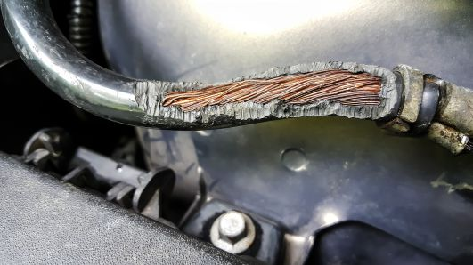
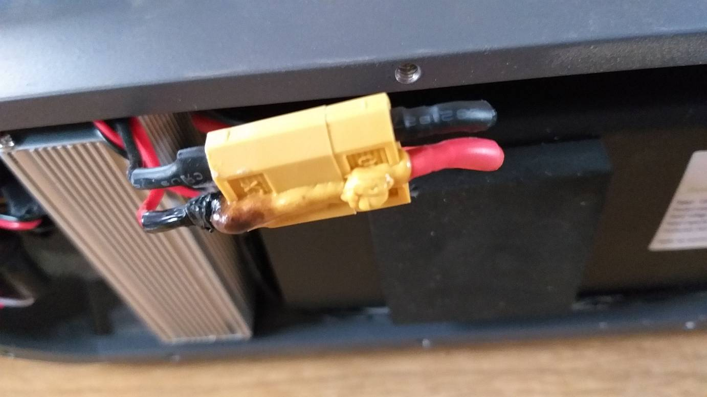

# Battery how-to
Guide for inspecting, storing, charging, and using the battery

# Battery components

The battery system is packages with several components for safe battery usage. Here is the list of battery components in your kit:

| Component | Quantity |
|-|-|
| LiPo battery | 2 |
| LiPo charger | 1 |
| LiPo safety bag | 2 |
| Low voltage monitor | 2 |
| Fused extension cable | 1 |
| Switch cable | 1 |

## LiPo battery
The LiPo battery for the Pi is a LiPo battery with 3 cells connected in series (3S battery) with 5200mAh. This should keeps the robot fully **running for ~2 hours**, or **idling for ~6 hours**. The battery has an XT60 connector for power output and a JST-XH balancing lead for monitoring individual cells.  

## LiPo charger
The charger included is a LiPo balancing lead charger. It charges and monitor individual battery cell's voltage through the balancing lead to make sure no cell exceeds the rated voltage of LiPo battery (4.2V). The charger is designed to charge at up to 2000mA per cell and supports 2 or 3 cells battery. It does **NOT** support charging **2 batteries at the same time**.

<!-- > [!CAUTION]
> This LiPo charger is simple. Too simple for charging EVERY kind of battery. It can destroy the batteries, itself, and burn down your place if misused. Therefore, here is a list of DO-NOTs:
> 1. Do not use it for any battery that is not LiPo. 
> 2. Do not use it to charge two batteries at the same time.
> 3. Do not use it to charge battery with lower than 2000mAh.
> 4. Do not leave it unattended while charging. -->

## LiPo safety bag
Two fireproof bags are provided for storing the batteries while not in use.

## Fused extension cable
For additional protection when the battery is not plugged into the [Raven board](https://github.com/MASLAB/kitbot-how-to?tab=readme-ov-file#hardwares), a 30A fused cable is provided for overcurrent protection. The fuse is replacable but let's do our best to never have to replace it.

## Switch extension cable
In case the robot becomes sentient and goes on a rampage, something is burning, or any other emergency situation, a switch extension cable is provided. The switch will turn off connection to the battery and cut off power supply to the robot.

## Low voltage monitor
Low voltage monitors are provided to make sure that the battery cell voltages do not fall below a safety threshold (3.3V) during use. They continuously monitor the voltages through the safety leads and let out a loud a buzz whenever any cell reaches the safety threshold.

<!-- > [!IMPORTANT]  
> Please have the low voltage monitor connected to the battery balancing lead **as long as the battery is in use**. When not in use, feel free to remove the monitor and store the battery in the battery safe bag. -->

<!-- > [!IMPORTANT]  
> The low voltage monitor is polarized. Please be careful when installing the balancing lead. The black wire should be connected to the first pin (BBX end) as shown in the previous picture. Below is a reference from older generation of the product.
> 

> 
> 
 -->

<!-- ## Full battery connection diagram

> [!CAUTION]
> The battery will also power the Pi on through Raven board and conflicts with the USB-C power adapter. **DO NOT USE THE USB-C POWER ADAPTER WITH THE PI WHILE THE BATTERY IS PLUGGED IN** -->

# Battery inspection

Lipo batteries can be physically damaged (puncture, bend, etc) or electrically damaged (overcharged, overdischarged, overcurrent). Our battery comes in hard plastic shell to prevent physical damage, and we do everything we can to prevent electrical damage. However, accidents can happen and we need to know how to check for damages.

## Physical inspection

### Swollen battery
Badly damaged LiPo battery will swell. Check for signs of battery swelling. For reference, the left battery is a normal battery and the right battery is damaged.

> [!TIP]
> Even though our battery has a hard plastic casing, a swelling battery may cause the shell to warp and no longer sits flat on the table.

> [!CAUTION]
> Swollen battery is extremely dangerous and may burst into flame at anytime! Please inform a MASLAB staff immediately for proper disposal once there is any sign of swelling.

### Leads
The batteries may be subjected to many rounds of plug-unplugs, scraping, electrical problems, etc. These may cause damages to the insulation and the connectors. Please check the wires for any sign of burns, and exposed conductors. Here is some refence for exposed wire and damaged connector:

## Electrical inspection

Cell voltage is a good indicator of battery health. Plug in the [low voltage monitor](#low-voltage-monitor) to check for cell voltages. The cell voltages should read **between 3.3V and 4.2V** for a healthy LiPo battery.

# Additional resources
MIT EHS provides a general checklist for using Lithium batteries. Feel free to print them out for references. They can be downloaded here: https://ehs.mit.edu/wp-content/uploads/2019/09/Lithium_Battery_Checklist.pdf
